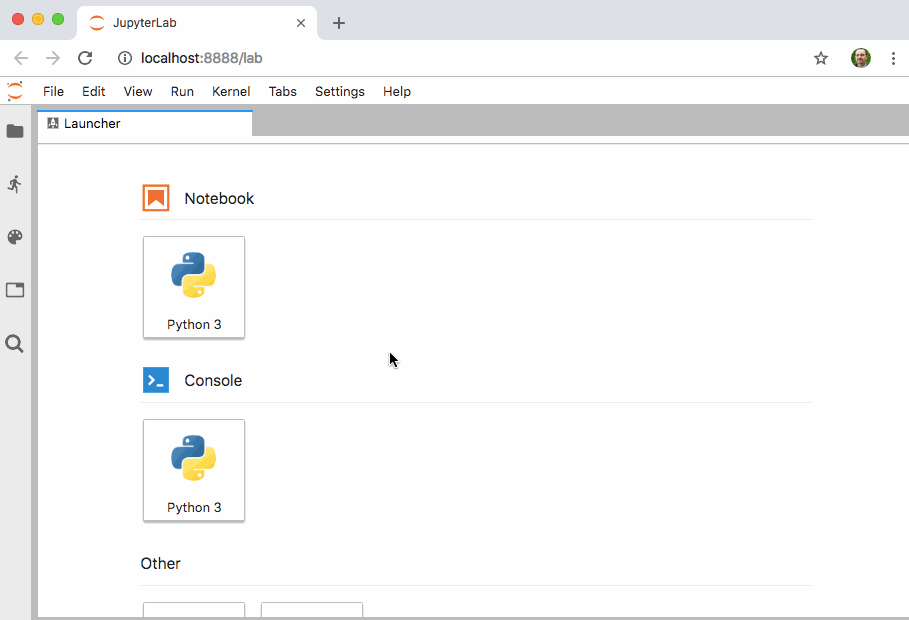

# jupyterlab-quickopen

[](https://mybinder.org/v2/gh/parente/jupyterlab-quickopen/master?urlpath=lab%2Ftree%2Fbinder%2Ftutorial.ipynb)

Quickly open a file in JupyterLab by typing part of its name



## Compatibility

- Python >=3.6.x
- JupyterLab >=1.0,<2.0
- Jupyter Notebook >=5.2,<6.0
- Notebook server configurations where notebook documents and other files reside on the local
  filesystem (which is the the notebook server default)

## Install

Install the Jupyter Notebook server extension under `PREFIX` (e.g., the active virtualenv or conda
env).

```
pip install jupyterlab-quickopen
```

Then install the JupyterLab frontend extension.

```
jupyter labextension install @parente/jupyterlab-quickopen
```

### Install Alternatives

You can use `jupyter serverextension` commands to enable and disable the server extension in
different contexts, e.g.:

```
jupyter serverextension enable --py jupyterlab_quickopen --user
jupyter serverextension disable --py jupyterlab_quickopen --sys-prefix
```

## Configure

### A Keyboard Shortcut

You can assign a keyboard shortcut to show the quickopen panel at any time. Open the keyboard editor
by clicking _Settings &rarr; Advanced Settings Editor &rarr; Keyboard Shortcuts_. Then enter JSON in
the _User Overrides_ text area like the following, adjusting the `keys` value to assign the shortcut
of your choosing:

```
{
  "shortcuts": [
    {
      "command": "quickopen:activate",
      "keys": [
        "Accel Ctrl P"
      ],
      "selector": "body",
      "title": "Activate Quick Open",
      "category": "Main Area"
    }
  ]
}
```

### Patterns to Exclude

You can control which files to exclude from the quick open list using Notebook server settings,
JupyterLab settings, or both.

On the server side, use the `ContentsManager.allow_hidden` and/or `ContentsManager.hide_globs`
settings. See the
[documentation about Jupyter Notebook options](https://jupyter-notebook.readthedocs.io/en/stable/config.html)
for details.

In the JupyterLab web app, open the _Settings_ menu, click the _Advanced Settings Editor_ option,
select the _Quick Open_ item in the _Raw View_ sidebar, and enter JSON in the _User Overrides_ text
area to override the default values.


## Develop

The project includes a Makefile which makes setting up a development environment using `pipenv`
easy. You must also install the latest Node LTS release as a prerequisite.

```
# Create a dev environment
make pipenv

# Activate the dev environment
make shell

# Install the frontend and server extensions
make build

# In one terminal, watch the frontend extension source for changes and rebuild
# the extension package
make watch-src

# In a second terminal, watch for rebuilt extension packages and rebuild
# jupyterlab to include them
make watch-lab
```

Keep an eye on the terminal running `watch-src` for TypeScript build errors. Keep an eye on the
terminal running `watch-lab` to know when to refresh your browser. Quit and re-run the
`make watch-lab` command any time you make changes to the **server** extension.

## FAQ

_Does this belong in JupyterLab?_

Maybe. To start, I wanted to do some hacking and it's easiest to do that in a small, independent
repo. Putting this feature into JupyterLab-proper requires making the server-side portion work with
`ContentManagers` that are not based on the local filesystem. That change might require a new
`ContentManager` API since walking the file hierarchy via HTTP calls is pretty heavyweight.
Python/TypeScript tests are also required.
