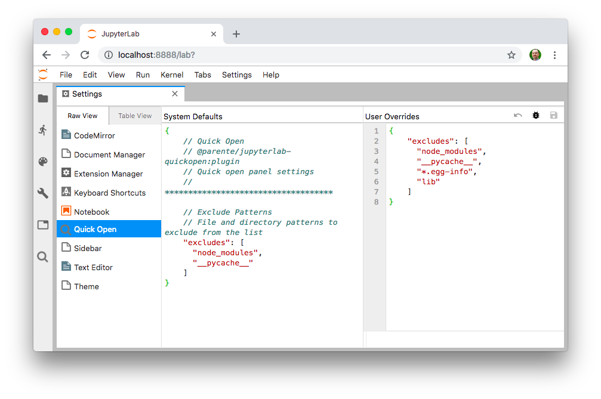

# jupyterlab-quickopen

[](https://mybinder.org/v2/gh/parente/jupyterlab-quickopen/master?urlpath=lab%2Ftree%2Fbinder%2Ftutorial.ipynb)

Quickly open a file in JupyterLab by typing part of its name


## Compatibility

- Python >=3.7.x
- [JupyterLab](https://github.com/jupyterlab/jupyterlab) >=3.2,<4.0
- [Jupyter Server](https://github.com/jupyter/jupyter_server) >=1.6,<2.0
- Configurations where notebook documents and other files reside on a filesystem local to the
  Jupyter Server (which is the the default), not remote storage (e.g., S3)

## Install

Starting in version 1.0 of this extension, the frontend portion of this extension is pre-compiled
and included in the `pip` installed package thanks to [changes in the JupyterLab 3.0 packaging
system](https://jupyterlab.readthedocs.io/en/stable/getting_started/changelog.html#extensions-can-be-installed-without-building-jupyterlab-with-nodejs).

To install the Jupyter Notebook server extension under `PREFIX` (e.g., the active virtualenv or conda
env), run the following:

```bash
pip install jupyterlab-quickopen
```

## Configure

### A Keyboard Shortcut

You can assign a keyboard shortcut to show the quickopen panel at any time. Open the keyboard editor
by clicking _Settings &rarr; Advanced Settings Editor &rarr; Keyboard Shortcuts_. Then enter JSON in
the _User Overrides_ text area like the following, adjusting the `keys` value to assign the shortcut
of your choosing:

```json
{
  "shortcuts": [
    {
      "command": "quickopen:activate",
      "keys": ["Accel Ctrl P"],
      "selector": "body",
      "title": "Activate Quick Open",
      "category": "Main Area"
    }
  ]
}
```

### Patterns to Exclude

You can control which files to exclude from the quick open list using Notebook server settings,
JupyterLab settings, or both.

On the server side, use the `ContentsManager.allow_hidden` and/or `ContentsManager.hide_globs`
settings. See the
[documentation about Jupyter Notebook options](https://jupyter-notebook.readthedocs.io/en/stable/config.html)
for details.

In the JupyterLab web app, open the _Settings_ menu, click the _Advanced Settings Editor_ option,
select the _Quick Open_ item in the _Raw View_ sidebar, and enter JSON in the _User Overrides_ text
area to override the default values.



## Develop

The project includes a Makefile to aid setting up a development environment using `python3`, `venv`,
and `pip`. You must also install the latest Node LTS release as a prerequisite.

```bash
# Create a dev environment
make venv

# Activate the dev environment
`make shell`

# In one terminal, watch the frontend source for changes and rebuild the extension
make watch

# In a second terminal, run JupyterLab.
`make shell`
make lab
```

Keep an eye on the terminal running `make watch` for TypeScript build errors. Quit and re-run the
`make lab` command any time you make changes to the **server** extension.

## Release

Make a commit with version number bumps in `package.json`. Then do the following.

```bash
# Tag the release commit
git tag -a -m "0.4.0" 0.4.0

# Activate the dev environment
`make shell`

# Build, sign, and push release to test.pypi.org
make release

# Build, sign and push releases to pypi.org
make release PYPI_URI=pypi
```

## FAQ

_Does this belong in JupyterLab?_

Maybe. To start, I wanted to do some hacking and it's easiest to do that in a small, independent
repo. Putting this feature into JupyterLab-proper requires making the server-side portion work with
`ContentManagers` that are not based on the local filesystem. That change might require a new
`ContentManager` API since walking the file hierarchy via HTTP calls is pretty heavyweight.
Python/TypeScript tests are also required.

_Will this extension work with JupyterLab 2.x?_

Not since [version 0.5.0(https://github.com/parente/jupyterlab-quickopen/tree/0.5.0).
